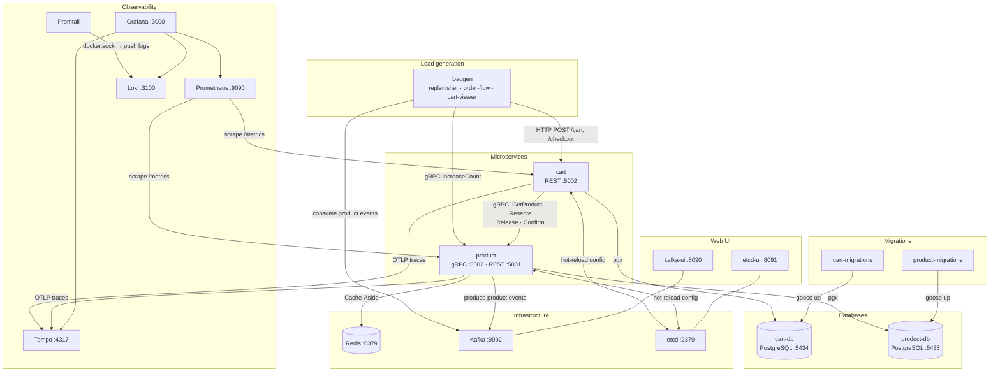

# marketplace-simulator — detailed documentation

[🇷🇺 Русский](README.md) · 🇬🇧 English

The orchestrating repository of the "Marketplace Simulator" educational project.

Launches the entire infrastructure via `docker-compose`: microservices, databases, load generator, and the observability stack.

## Table of contents

- [System components](#system-components)
- [Quick start](#quick-start)
- [Ports](#ports)
- [Configuration](#configuration)
- [Dynamic configuration (etcd)](#dynamic-configuration-etcd)
- [Service interaction architecture](#service-interaction-architecture)
- [Observability](#observability)
- [Service documentation](#service-documentation)

## System components

| Service                 | Repository                                                                                      | Description                                                          |
|-------------------------|-------------------------------------------------------------------------------------------------|----------------------------------------------------------------------|
| **product**             | [marketplace-simulator-product](https://github.com/jva44ka/marketplace-simulator-product)       | Product management (gRPC + REST, PostgreSQL, Redis, Kafka outbox)    |
| **cart**                | [marketplace-simulator-cart](https://github.com/jva44ka/marketplace-simulator-cart)             | Shopping cart (REST, PostgreSQL, Outbox)                             |
| **loadgen**             | [marketplace-simulator-loadgen](https://github.com/jva44ka/marketplace-simulator-loadgen)       | Load generator (replenisher, order flow, cart viewer)                |
| **product-db**          | postgres:17.7                                                                                   | Database for the product service                                     |
| **cart-db**             | postgres:17.7                                                                                   | Database for the cart service                                        |
| **product-migrations**  | migrator from [product](https://github.com/jva44ka/marketplace-simulator-product)               | Applies migrations to product-db on startup                          |
| **cart-migrations**     | migrator from [cart](https://github.com/jva44ka/marketplace-simulator-cart)                     | Applies migrations to cart-db on startup                             |
| **kafka**               | confluentinc/cp-kafka:7.9.0                                                                     | Message broker (product change events)                               |
| **kafka-ui**            | provectuslabs/kafka-ui                                                                          | Web UI for Kafka                                                     |
| **redis**               | redis:7-alpine                                                                                  | Read cache for the product service (Cache-Aside)                     |
| **etcd**                | quay.io/coreos/etcd:v3.5.16                                                                     | Dynamic configuration store for services                             |
| **etcd-ui**             | evildecay/etcdkeeper (custom build)                                                             | Web UI for etcd                                                      |
| **prometheus**          | prom/prometheus                                                                                 | Metrics collection from services                                     |
| **tempo**               | grafana/tempo:2.6.1                                                                             | Distributed trace storage (OTLP)                                     |
| **loki**                | grafana/loki:3.4.2                                                                              | Log storage                                                          |
| **promtail**            | grafana/promtail:3.4.2                                                                          | Log collection agent from Docker containers                          |
| **grafana**             | grafana/grafana                                                                                 | Dashboards, metrics, traces, logs                                    |

## Quick start

### Requirements

- [Docker](https://docs.docker.com/get-docker/) + [Docker Compose](https://docs.docker.com/compose/install/)

### Start

```bash
git clone https://github.com/jva44ka/marketplace-simulator.git
cd marketplace-simulator
docker-compose up
```

All services start automatically. Migrations are applied on first run — no need to wait separately.

On first startup each service writes its YAML config to etcd (`/config/product`, `/config/cart`, `/config/loadgen`). After that, config can be changed via the etcd UI without restarting services.

The first run downloads images (~2–3 minutes). Subsequent starts take seconds.

### Stop

```bash
# stop, keeping data
docker-compose down

# stop and delete all data (DB, metrics, traces, etcd)
docker-compose down -v
```

### UI after startup

| Service | URL | Description |
|---------|-----|-------------|
| Grafana | [http://localhost:3000](http://localhost:3000) | Dashboards, metrics, traces, logs (admin / admin) |
| Prometheus | [http://localhost:9090](http://localhost:9090) | Metrics, PromQL |
| Kafka UI | [http://localhost:8090](http://localhost:8090) | Topics, consumers, messages |
| etcd UI | [http://localhost:8091](http://localhost:8091) | View and edit service config |
| Swagger — product | [http://localhost:5001/swagger/](http://localhost:5001/swagger/) | REST API of the product service |
| Swagger — cart | [http://localhost:5002/swagger/](http://localhost:5002/swagger/) | REST API of the cart service |

## Ports

| Service     | Host port | Description                     |
|-------------|-----------|----------------------------------|
| product     | 5001      | HTTP (grpc-gateway + REST)       |
| cart        | 5002      | HTTP REST                        |
| product-db  | 5433      | PostgreSQL                       |
| cart-db     | 5434      | PostgreSQL                       |
| redis       | 6379      | Redis (product cache)            |
| kafka       | 9092      | Kafka broker                     |
| kafka-ui    | 8090      | Kafka UI                         |
| etcd        | 2379      | etcd client API                  |
| etcd-ui     | 8091      | etcd UI (etcdkeeper)             |
| prometheus  | 9090      | Prometheus UI                    |
| tempo       | 4317      | OTLP gRPC receiver               |
| loki        | 3100      | Loki HTTP API                    |
| grafana     | 3000      | Grafana (admin / admin)          |

## Configuration

Config files are located in `configs/`:

| File               | Purpose                                   |
|--------------------|-------------------------------------------|
| `product.yaml`     | Product service config                    |
| `cart.yaml`        | Cart service config                       |
| `loadgen.yaml`     | Load generator config                     |
| `prometheus.yml`   | Prometheus config (scrape jobs)           |
| `tempo.yaml`       | Tempo config                              |
| `loki.yaml`        | Loki config                               |
| `promtail.yaml`    | Promtail config (log collection)          |
| `grafana/`         | Grafana provisioning and dashboards       |

## Dynamic configuration (etcd)

On first startup each service automatically writes its YAML config to etcd. After that, config can be changed in real time — without restarting services.

### What changes without a restart

| Service | Parameters |
|---------|-----------|
| **product** | rate-limiter (rps, burst, enabled), authorization, request/response logging, intervals and settings of all jobs |
| **cart** | circuit breaker (threshold, timeout, half-open), retry (attempts, backoff), gRPC client timeout, all job settings |
| **loadgen** | RPS for order-flow and cart-viewer workers, replenisher threshold and restock volume |

### How to change config

**Via etcd UI** ([http://localhost:8091](http://localhost:8091)) — open the key `/config/product`, `/config/cart`, or `/config/loadgen`, edit the YAML, save.

**Via etcdctl:**

```bash
# View current product config
docker exec etcd etcdctl get /config/product

# Lower rate limit to 10 RPS
docker exec etcd etcdctl put /config/product "$(
  docker exec etcd etcdctl get /config/product --print-value-only \
  | sed 's/rps: 500/rps: 10/'
)"

# Tighten circuit breaker in cart
docker exec etcd etcdctl put /config/cart "$(
  docker exec etcd etcdctl get /config/cart --print-value-only \
  | sed 's/threshold: 0.6/threshold: 0.3/'
)"

# Reduce loadgen traffic
docker exec etcd etcdctl put /config/loadgen "$(
  docker exec etcd etcdctl get /config/loadgen --print-value-only \
  | sed 's/rps: 100/rps: 10/'
)"
```

Changes take effect within a second — no container restarts needed.

## Service interaction architecture

### System overview



### Add item to cart

```
  Client             cart :5002        product :8002       redis        product-db
    │                     │                  │               │               │
    │ POST /cart/{sku}    │                  │               │               │
    ├────────────────────►│                  │               │               │
    │                     │ GetProduct(sku)  │               │               │
    │                     ├─────────────────►│               │               │
    │                     │                  │  GET product  │               │
    │                     │                  ├──────────────►│               │
    │                     │                  │  (cache hit)  │               │
    │                     │                  │◄──────────────┤               │
    │                     │◄─────────────────┤               │               │
    │◄────────────────────┤                  │               │               │
    │        200 OK       │                  │               │               │
```

On a cache miss, product reads from the database and warms the cache asynchronously. When Redis is unavailable, only the database is used.

Cart calls product to get product data (price, name). **No reservation happens when adding to cart** — only at checkout.

### Checkout

Synchronous part — within the HTTP request:

```
  Client         cart :5002      cart-db       product :8002    product-db
    │                 │               │               │               │
    │ POST /checkout  │               │               │               │
    ├────────────────►│               │               │               │
    │                 │          Reserve(skus) ①      │               │
    │                 ├───────────────────────────────►               │
    │                 │               │               │ INSERT reserv.│
    │                 │               │               ├──────────────►│
    │                 │               │               │◄──────────────┤
    │                 │◄──────────────────────────────┤               │
    │                 │ TX: DELETE cart ②             │               │
    │                 │ INSERT outbox  │               │               │
    │                 ├──────────────►│               │               │
    │                 │◄──────────────┤               │               │
    │◄────────────────┤               │               │               │
    │    200 OK       │               │               │               │
```

Asynchronous part — outbox jobs running in the background:

```
cart outbox job   product :8002    product-db        kafka          loadgen
      │                 │               │               │               │
      │ ConfirmReserv.③ │               │               │               │
      ├────────────────►│               │               │               │
      │                 │ UPDATE stock  │               │               │
      │                 │ DELETE reserv.│               │               │
      │                 ├──────────────►│               │               │
      │                 │◄──────────────┤               │               │
      │◄────────────────┤               │               │               │
      │           product outbox job ④  │               │               │
      │                 ├───────────────────────────────►               │
      │                 │               │               │ product.events│
      │                 │               │               ├──────────────►│
      │                 │               │ IncreaseCount ⑤               │
      │                 │◄──────────────────────────────────────────────┤
      │                 │ UPDATE stock  │               │               │
      │                 ├──────────────►│               │               │
      │                 │◄──────────────┤               │               │
```

**①** Cart calls `Reserve` — product creates reservation records; stock counts are not changed yet.

**②** Cart atomically clears the cart and creates outbox records in a single transaction. On transaction failure it immediately calls `ReleaseReservation`.

**③** Cart outbox job asynchronously calls `ConfirmReservation` — product deducts stock and deletes the reservations. Delivery is **at-least-once**: both `ConfirmReservation` and `ReleaseReservation` are **idempotent** — a repeated call with already-processed IDs is safe. On failure — retry; after exhausting retries — dead letter.

**④** Product publishes a product-change event to Kafka via its own outbox.

**⑤** Loadgen replenisher reads the `product.events` topic and restocks when the count drops below the threshold.

## Observability

| Tool | What it collects | Address |
|------|-----------------|---------|
| Prometheus | Service metrics | [http://localhost:9090](http://localhost:9090) |
| Tempo | Distributed traces | via Grafana |
| Loki | Logs from all containers | via Grafana |
| Grafana | Unified UI | [http://localhost:3000](http://localhost:3000) (admin / admin) |

Grafana datasource links:
- From a trace (Tempo) → jump to logs (Loki) by `traceId`
- From a log (Loki) → jump to a trace (Tempo) by `traceId`
- From a trace (Tempo) → jump to metrics (Prometheus)

### Dashboards

All dashboards are available in the **Marketplace Simulator** folder after logging into Grafana:

| Dashboard | Link | What to look at |
|-----------|------|-----------------|
| Cart Service | [→](http://localhost:3000/d/marketplace-cart) | HTTP RPS, latency, errors, DB pool, outbox, business metrics |
| Products Service | [→](http://localhost:3000/d/marketplace-products) | gRPC RPS, latency, optimistic lock failures, outbox, Cache/Redis hit rate & latency |
| Business Metrics | [→](http://localhost:3000/d/marketplace-business) | Order funnel, revenue, active carts |
| Outbox Overview | [→](http://localhost:3000/d/marketplace-outbox-overview) | Queue and dead letter for both services |
| Postgres Overview | [→](http://localhost:3000/d/marketplace-postgres-overview) | Connection pools, DB query latency |

## Service documentation

- [marketplace-simulator-product](https://github.com/jva44ka/marketplace-simulator-product) — [docs](https://github.com/jva44ka/marketplace-simulator-product/blob/main/docs/README.md) · Swagger: [http://localhost:5001/swagger/](http://localhost:5001/swagger/) · Metrics: [http://localhost:5001/metrics](http://localhost:5001/metrics)
- [marketplace-simulator-cart](https://github.com/jva44ka/marketplace-simulator-cart) — [docs](https://github.com/jva44ka/marketplace-simulator-cart/blob/main/docs/README.md) · Swagger: [http://localhost:5002/swagger/](http://localhost:5002/swagger/) · Metrics: [http://localhost:5002/metrics](http://localhost:5002/metrics)
- [marketplace-simulator-loadgen](https://github.com/jva44ka/marketplace-simulator-loadgen) — [docs](https://github.com/jva44ka/marketplace-simulator-loadgen/blob/main/docs/README.md)
