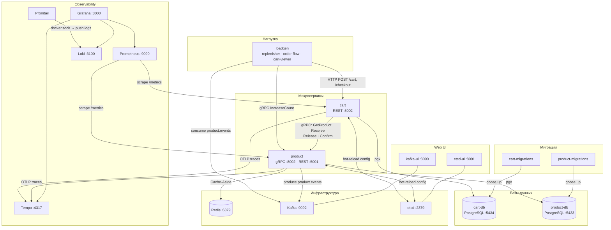

# marketplace-simulator — подробная документация

Оркестрирующий репозиторий учебного проекта «Симулятор маркетплейса».

Запускает всю инфраструктуру через `docker-compose`: микросервисы, базы данных, генератор нагрузки и observability-стек.

## Содержание

- [Состав системы](#состав-системы)
- [Быстрый старт](#быстрый-старт)
- [Порты](#порты)
- [Конфигурация](#конфигурация)
- [Динамическая конфигурация (etcd)](#динамическая-конфигурация-etcd)
- [Архитектура взаимодействия сервисов](#архитектура-взаимодействия-сервисов)
- [Observability](#observability)
- [Документация сервисов](#документация-сервисов)

## Состав системы

| Сервис                  | Репозиторий                                                                                     | Описание                                                            |
|-------------------------|-------------------------------------------------------------------------------------------------|---------------------------------------------------------------------|
| **product**             | [marketplace-simulator-product](https://github.com/jva44ka/marketplace-simulator-product)       | Управление товарами (gRPC + REST, PostgreSQL, Redis, Kafka outbox)  |
| **cart**                | [marketplace-simulator-cart](https://github.com/jva44ka/marketplace-simulator-cart)             | Корзина покупок (REST, PostgreSQL, Outbox)                          |
| **loadgen**             | [marketplace-simulator-loadgen](https://github.com/jva44ka/marketplace-simulator-loadgen)       | Генератор нагрузки (replenisher, order flow, cart viewer)           |
| **product-db**          | postgres:17.7                                                                                   | БД сервиса товаров                                                  |
| **cart-db**             | postgres:17.7                                                                                   | БД сервиса корзины                                                  |
| **product-migrations**  | migrator из [product](https://github.com/jva44ka/marketplace-simulator-product)                 | Накатывает миграции в product-db при старте                         |
| **cart-migrations**     | migrator из [cart](https://github.com/jva44ka/marketplace-simulator-cart)                       | Накатывает миграции в cart-db при старте                            |
| **kafka**               | confluentinc/cp-kafka:7.9.0                                                                     | Брокер сообщений (события об изменении товаров)                     |
| **kafka-ui**            | provectuslabs/kafka-ui                                                                          | Веб-интерфейс для Kafka                                             |
| **redis**               | redis:7-alpine                                                                                  | Кеш чтений товаров для product-сервиса (Cache-Aside)                |
| **etcd**                | quay.io/coreos/etcd:v3.5.16                                                                     | Хранилище динамической конфигурации сервисов                        |
| **etcd-ui**             | evildecay/etcdkeeper (custom build)                                                             | Веб-интерфейс для etcd                                              |
| **prometheus**          | prom/prometheus                                                                                 | Сбор метрик с сервисов                                              |
| **tempo**               | grafana/tempo:2.6.1                                                                             | Хранилище трейсов (OTLP)                                            |
| **loki**                | grafana/loki:3.4.2                                                                              | Хранилище логов                                                     |
| **promtail**            | grafana/promtail:3.4.2                                                                          | Агент сбора логов из Docker-контейнеров                             |
| **grafana**             | grafana/grafana                                                                                 | Дашборды, метрики, трейсы, логи                                     |

## Быстрый старт

### Требования

- [Docker](https://docs.docker.com/get-docker/) + [Docker Compose](https://docs.docker.com/compose/install/)

### Запуск

```bash
git clone https://github.com/jva44ka/marketplace-simulator.git
cd marketplace-simulator
docker-compose up
```

Все сервисы запустятся автоматически. Миграции применятся при первом старте — дожидаться отдельно не нужно.

При первом запуске каждый сервис запишет свой YAML-конфиг в etcd (`/config/product`, `/config/cart`, `/config/loadgen`). После этого конфиг можно менять через etcd UI без рестарта сервисов.

Первый запуск скачает образы (~2–3 минуты). Последующие старты — секунды.

### Остановка

```bash
# остановить, сохранив данные
docker-compose down

# остановить и удалить все данные (БД, метрики, трейсы, etcd)
docker-compose down -v
```

### UI после запуска

| Сервис | Ссылка | Описание |
|--------|--------|----------|
| Grafana | [http://localhost:3000](http://localhost:3000) | Дашборды, метрики, трейсы, логи (admin / admin) |
| Prometheus | [http://localhost:9090](http://localhost:9090) | Метрики, PromQL |
| Kafka UI | [http://localhost:8090](http://localhost:8090) | Топики, консьюмеры, сообщения |
| etcd UI | [http://localhost:8091](http://localhost:8091) | Просмотр и редактирование конфига сервисов |
| Swagger — product | [http://localhost:5001/swagger/](http://localhost:5001/swagger/) | REST API сервиса товаров |
| Swagger — cart | [http://localhost:5002/swagger/](http://localhost:5002/swagger/) | REST API сервиса корзины |

## Порты

| Сервис      | Хост-порт | Описание                        |
|-------------|-----------|---------------------------------|
| product     | 5001      | HTTP (grpc-gateway + REST)      |
| cart        | 5002      | HTTP REST                       |
| product-db  | 5433      | PostgreSQL                      |
| cart-db     | 5434      | PostgreSQL                      |
| redis       | 6379      | Redis (кеш product)             |
| kafka       | 9092      | Kafka broker                    |
| kafka-ui    | 8090      | Kafka UI                        |
| etcd        | 2379      | etcd client API                 |
| etcd-ui     | 8091      | etcd UI (etcdkeeper)            |
| prometheus  | 9090      | Prometheus UI                   |
| tempo       | 4317      | OTLP gRPC receiver              |
| loki        | 3100      | Loki HTTP API                   |
| grafana     | 3000      | Grafana (admin / admin)         |

## Конфигурация

Файлы конфигурации находятся в `configs/`:

| Файл               | Назначение                               |
|--------------------|------------------------------------------|
| `product.yaml`     | Конфиг сервиса товаров                   |
| `cart.yaml`        | Конфиг сервиса корзины                   |
| `loadgen.yaml`     | Конфиг генератора нагрузки               |
| `prometheus.yml`   | Конфиг Prometheus (scrape jobs)          |
| `tempo.yaml`       | Конфиг Tempo                             |
| `loki.yaml`        | Конфиг Loki                              |
| `promtail.yaml`    | Конфиг Promtail (сбор логов)             |
| `grafana/`         | Provisioning и дашборды Grafana          |

## Динамическая конфигурация (etcd)

При первом старте каждый сервис автоматически записывает свой YAML-конфиг в etcd. После этого конфиг можно менять в реальном времени — без рестарта сервисов.

### Что меняется без рестарта

| Сервис | Параметры |
|--------|-----------|
| **product** | rate-limiter (rps, burst, enabled), авторизация, логирование запросов/ответов, интервалы и настройки всех джоб |
| **cart** | circuit breaker (порог, timeout, half-open), retry (attempts, backoff), timeout gRPC-клиента, настройки всех джоб |
| **loadgen** | RPS воркеров order-flow и cart-viewer, порог и объём пополнения replenisher |

### Как изменить конфиг

**Через etcd UI** ([http://localhost:8091](http://localhost:8091)) — открыть ключ `/config/product`, `/config/cart` или `/config/loadgen`, отредактировать YAML, сохранить.

**Через etcdctl:**

```bash
# Посмотреть текущий конфиг product
docker exec etcd etcdctl get /config/product

# Снизить rate limit до 10 RPS
docker exec etcd etcdctl put /config/product "$(
  docker exec etcd etcdctl get /config/product --print-value-only \
  | sed 's/rps: 500/rps: 10/'
)"

# Ужесточить circuit breaker в cart
docker exec etcd etcdctl put /config/cart "$(
  docker exec etcd etcdctl get /config/cart --print-value-only \
  | sed 's/threshold: 0.6/threshold: 0.3/'
)"

# Снизить нагрузку loadgen
docker exec etcd etcdctl put /config/loadgen "$(
  docker exec etcd etcdctl get /config/loadgen --print-value-only \
  | sed 's/rps: 100/rps: 10/'
)"
```

Изменение применяется в течение секунды — без рестарта контейнеров.

## Архитектура взаимодействия сервисов

### Обзор сервисов



### Добавление товара в корзину

```
  Client             cart :5002        product :8002       redis        product-db
    │                     │                  │               │               │
    │ POST /cart/{sku}    │                  │               │               │
    ├────────────────────►│                  │               │               │
    │                     │ GetProduct(sku)  │               │               │
    │                     ├─────────────────►│               │               │
    │                     │                  │  GET product  │               │
    │                     │                  ├──────────────►│               │
    │                     │                  │  (cache hit)  │               │
    │                     │                  │◄──────────────┤               │
    │                     │◄─────────────────┤               │               │
    │◄────────────────────┤                  │               │               │
    │        200 OK       │                  │               │               │
```

При cache miss product обращается к БД и асинхронно прогревает кеш. При недоступном Redis — только БД.

Сервис cart обращается к product за данными о товаре (цена, название). Резервирование при добавлении в корзину **не происходит** — только при чекауте.

### Оформление заказа (checkout)

Синхронная часть — в рамках HTTP-запроса:

```
  Client         cart :5002      cart-db       product :8002    product-db
    │                 │               │               │               │
    │ POST /checkout  │               │               │               │
    ├────────────────►│               │               │               │
    │                 │          Reserve(skus) ①      │               │
    │                 ├───────────────────────────────►               │
    │                 │               │               │ INSERT reserv.│
    │                 │               │               ├──────────────►│
    │                 │               │               │◄──────────────┤
    │                 │◄──────────────────────────────┤               │
    │                 │ TX: DELETE cart ②             │               │
    │                 │ INSERT outbox  │               │               │
    │                 ├──────────────►│               │               │
    │                 │◄──────────────┤               │               │
    │◄────────────────┤               │               │               │
    │    200 OK       │               │               │               │
```

Асинхронная часть — outbox jobs в фоне:

```
cart outbox job   product :8002    product-db        kafka          loadgen
      │                 │               │               │               │
      │ ConfirmReserv.③ │               │               │               │
      ├────────────────►│               │               │               │
      │                 │ UPDATE stock  │               │               │
      │                 │ DELETE reserv.│               │               │
      │                 ├──────────────►│               │               │
      │                 │◄──────────────┤               │               │
      │◄────────────────┤               │               │               │
      │           product outbox job ④  │               │               │
      │                 ├───────────────────────────────►               │
      │                 │               │               │ product.events│
      │                 │               │               ├──────────────►│
      │                 │               │ IncreaseCount ⑤               │
      │                 │◄──────────────────────────────────────────────┤
      │                 │ UPDATE stock  │               │               │
      │                 ├──────────────►│               │               │
      │                 │◄──────────────┤               │               │
```

**①** Cart вызывает `Reserve` — product создаёт записи резервирований, остатки пока не изменяются.

**②** Cart в одной транзакции очищает корзину и создаёт outbox-записи. При ошибке транзакции сразу вызывает `ReleaseReservation`.

**③** Cart outbox job асинхронно вызывает `ConfirmReservation` — product списывает товары со склада и удаляет резервирования. Доставка **at-least-once**: оба метода (`ConfirmReservation`, `ReleaseReservation`) **идемпотентны** — повторный вызов с уже обработанными ID безопасен. При неудаче — ретрай, после исчерпания попыток — dead letter.

**④** Product публикует событие об изменении товара в Kafka через собственный outbox.

**⑤** Loadgen-replenisher читает топик `product.events` и пополняет склад когда остаток падает ниже порога.

## Observability

| Инструмент | Что собирает | Адрес |
|------------|-------------|-------|
| Prometheus | Метрики сервисов | [http://localhost:9090](http://localhost:9090) |
| Tempo | Распределённые трейсы | через Grafana |
| Loki | Логи всех контейнеров | через Grafana |
| Grafana | Единый UI | [http://localhost:3000](http://localhost:3000) (admin / admin) |

Datasource-связки внутри Grafana:
- Из трейса (Tempo) → переход в логи (Loki) по `traceId`
- Из лога (Loki) → переход в трейс (Tempo) по `traceId`
- Из трейса (Tempo) → переход в метрики (Prometheus)

### Дашборды

Все дашборды доступны в папке **Marketplace Simulator** после входа в Grafana:

| Дашборд | Ссылка | Что смотреть |
|---------|--------|-------------|
| Cart Service | [→](http://localhost:3000/d/marketplace-cart) | HTTP RPS, latency, ошибки, DB-пул, outbox, бизнес-метрики |
| Products Service | [→](http://localhost:3000/d/marketplace-products) | gRPC RPS, latency, optimistic lock failures, outbox, Cache/Redis hit rate & latency |
| Business Metrics | [→](http://localhost:3000/d/marketplace-business) | Воронка заказов, выручка, активные корзины |
| Outbox Overview | [→](http://localhost:3000/d/marketplace-outbox-overview) | Очередь и dead letter обоих сервисов |
| Postgres Overview | [→](http://localhost:3000/d/marketplace-postgres-overview) | Пулы соединений, latency запросов к БД |

## Документация сервисов

- [marketplace-simulator-product](https://github.com/jva44ka/marketplace-simulator-product) — [docs](https://github.com/jva44ka/marketplace-simulator-product/blob/main/docs/README.md) · Swagger: [http://localhost:5001/swagger/](http://localhost:5001/swagger/) · Метрики: [http://localhost:5001/metrics](http://localhost:5001/metrics)
- [marketplace-simulator-cart](https://github.com/jva44ka/marketplace-simulator-cart) — [docs](https://github.com/jva44ka/marketplace-simulator-cart/blob/main/docs/README.md) · Swagger: [http://localhost:5002/swagger/](http://localhost:5002/swagger/) · Метрики: [http://localhost:5002/metrics](http://localhost:5002/metrics)
- [marketplace-simulator-loadgen](https://github.com/jva44ka/marketplace-simulator-loadgen) — [docs](https://github.com/jva44ka/marketplace-simulator-loadgen/blob/main/docs/README.md)
