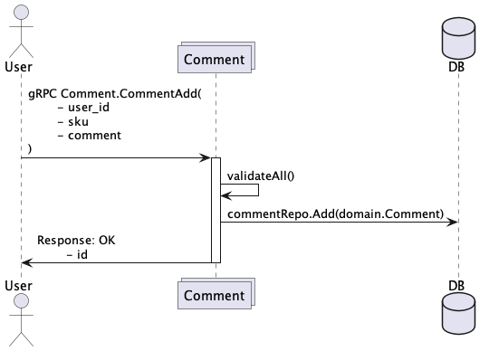
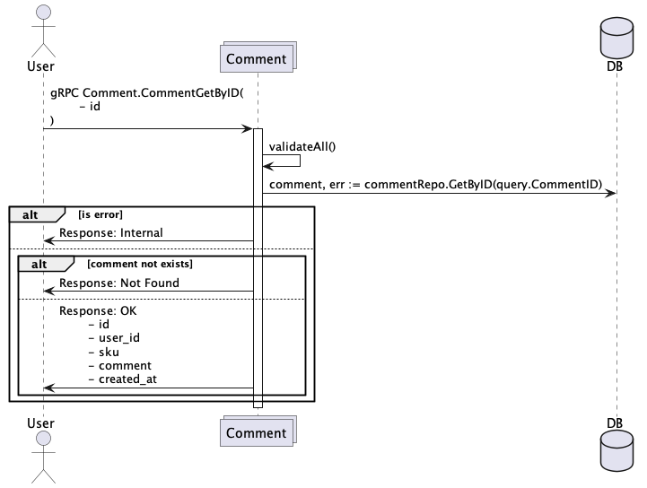
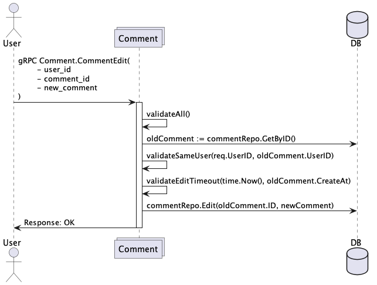
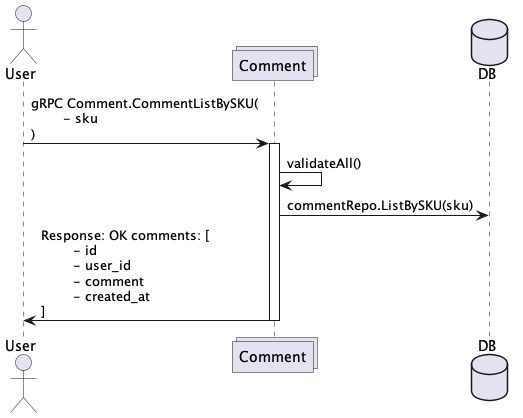
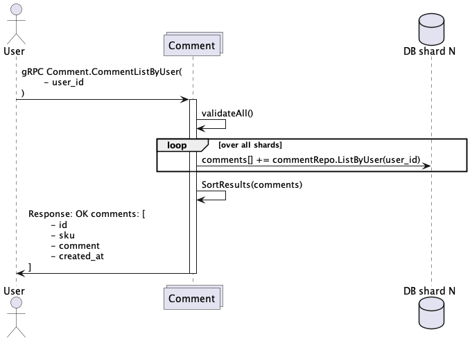

# Домашнее задание по модулю "Хранение данных в высоконагруженных системах"

Необходимо реализовать сервис для работы с пользовательскими комментариями о товарах.

## Основное задание

Необходимо реализовать сервис, отвечающий за фиксацию, хранение и обработку пользовательских комментариев о товарах.
Каждый пользователь может оставлять произвольное количество комментариев на любом из товаров. Комментарий представляет
собой сущность со следующими атрибутами:
- идентификатор комментария (id int64)
- идентификатор пользователя, оставившего комментарий (user_id int64)
- идентификатор товара, на котором был оставлен комментарий (sku int64)
- дата фиксации комментария (created_at дата и время с точностью до миллисекунд)
- текст комментария, без html тегов и прочей разметки (валидировать это не нужно) длиной до 255 байт

Необходимо реализовать следующие методы, описанные в спецификации ниже:
- добавление пользователем комментария к товару
- получение комментария по идентификатору
- редактирование пользователем комментария
- получение списка комментариев, оставленных всеми пользователями на конкретном товаре (для детальной страницы товара)
- получение всех комментариев конкретного пользователя на всех товарах (для личного кабинета пользователя)

  Согласно проведенной заранее аналитике предполагается, что запросов на получение всех комментариев всех пользователей
  на конкретном товаре будет значительно больше, чем запросов на получение всех комментариев конкретного пользователя.

Все оставленные комментарии должны быть сразу же доступны всем пользователям.

При редактировании необходимо учитывать, что пользователь может вносить изменения только в свои комментарии, и только
в течение 15 минут после создания (в тестах это значение установлено в 1 секунду). Никакой модерации и аудит-лога вести
не нужно. Удалять комментарии нельзя.

При отдаче комментариев в ручках чтения требуется упорядочивать комментарии в порядке, обратном хронологическому.
Допускается использовать системное время backend-а, а не время из БД. Комментарии, оставленные двумя разными
пользователями, в один момент времени должны быть упорядочены по возрастанию идентификатора пользователя, это позволит
добиться воспроизводимости результата и избежать моргания при обновлении интерфейса. Ожидается, что пользователь не
может оставить два комментария в одну и ту же миллисекунду (это считается мошенничеством и контролируется внешней по
отношению к реализуемому сервису системой). В основном задании реализацию пагинации делать не требуется.

Комментарии необходимо хранить длительное время и предполагается, что большое количество пользователей будут оставлять
большое количество комментариев на большом количестве товаров. Это обуславливает необходимость использования
шардированного хранилища.

Требование к решению:
- Создать protobuf контракт сервиса comment
    - Добавляем валидацию proto структур через proto-gen-validator
- Добавить в Makefile команды для генерации .go файлов из proto файлов и установки нужных зависимостей (используем protoc)
- Развернуть инфраструктуру из 2-х Postgres инстансов, каждый из которых будет использоваться в качестве шарда для
  хранения комментариев
- Реализовать ручки согласно спецификации
    - Реализовать валидацию бизнес-сценариев
- Реализовать репозиторные методы и другие необходимые программные компоненты для корректной работы решения
- Код должен быть покрыт тестами
- Добавить HTTP-gateway

## Дополнительное задание

1. Добавить пагинацию в ручке списка комментариев на предмете
    - вместо отдачи всех комментариев в ручке получения всех комментариев на конкретном предмете, необходимо отдавать 10
      самых свежих комментариев и реализовать функционал дозагрузки более старых комментариев
    - расширить контракт ручки необходимыми параметрами
    - комментариев будет много, поэтому недопустимо использование offset при чтении данных из БД, потому что это
      приводит к full scan и отбрасыванию прочитанных данных. Запрос должен отрабатывать за логарифмическую сложность
      поиска начала диапазона плюс линейную сложность чтения возвращаемого диапазона
2. Консистентное хеширование
    - для возможности динамического регулирования распределения данных по шардам и возможности добавления новых шардов
      без переноса лишних данных использовать консистентное хеширование

Спецификация для ручек в дополнительном задании не приводится, необходимо самостоятельно ее доработать. При этом
должна быть сохранена обратная совместимость с основным решением. Все новые поля должны иметь разумные значения
по умолчанию. Автоматические тесты для основного задания должны проходить и для дополнительного задания. При этом
гарантируется, что в тестах для каждого товара добавляется не более 10 комментариев.

## Спецификация

### Добавление комментария

При вызове данного метода в БД сохраняется ассоциированный с пользователем и товаром комментарий. Любой пользователь
может оставить произвольное количество комментариев на любом количестве товаров. Контроль аутентификации, проверку
существования пользователя и товара с такими user_id и sku реализовывать не требуется. Каким-то образом очищать
пользовательский комментарий от ненормативного содержания/html тегов и прочего не требуется.



**Параметры запроса:**

| Параметр | Тип данных | Валидация           | Описание                                               |
|----------|------------|---------------------|--------------------------------------------------------|
| user_id  | int64      | > 0                 | Идентификатор пользователя, автора комментария         |
| sku      | int64      | > 0                 | Идентификатор товара, к которому относится комментарий |
| comment  | string     | len > 0, len <= 255 | Текст комментария                                      |

Request
```
{
    user_id int64,
    sku int64,
    comment string
}
```

**Параметры ответа:**

| Параметр | Тип данных | Описание                  |
|----------|------------|---------------------------|
| id       | int64      | Идентификатор комментария |

Response
```
{
    id int64
}
```

### Получение комментария по идентификатору

Данный запрос возвращает комментарий по его идентификатору. Идентификатор комментария можно получить из ответа
метода добавления комментария или из ответа вызова списка комментариев.



**Параметры запроса:**

| Параметр | Тип данных | Валидация | Описание                  |
|----------|------------|-----------|---------------------------|
| id       | int64      | > 0       | Идентификатор комментария |

Request
```
{
    id int64
}
```

**Параметры ответа:**

| Параметр   | Тип данных | Описание                                              |
|------------|------------|-------------------------------------------------------|
| id         | int64      | Идентификатор комментария                             |
| user_id    | int64      | Идентификатор пользователя, оставившего комментарий   |
| sku        | int64      | Идентификатор товара, к которому относится комментарий|
| comment    | string     | Текст комментария                                     |
| created_at | datetime   | Момент создания комментария                           |

Response
```
{
    id int64,
    user_id int64,
    sku int64,
    comment string,
    created_at time
}
```

### Редактирование комментария

При вызове метода изменяется содержание комментария с указанным comment_id. Пользователь может редактировать только
комментарии, оставленные им самим. При попытке редактировать чужой комментарий возвращается ошибка Permission Denied. По
истечении 15 минут с момента создания (в тестах этот порог установлен в 1 секунду), возможность редактировать
комментарий блокируется. При этом возвращается ошибка Failed Precondition.



**Параметры запроса:**

| Параметр     | Тип данных | Валидация           | Описание                                         |
|--------------|------------|---------------------|--------------------------------------------------|
| user_id      | int64      | > 0                 | Идентификатор пользователя, автора комментария   |
| comment_id   | int64      | > 0                 | Идентификатор модифицируемого комментария        |
| new_comment  | string     | len > 0, len <= 255 | Новый текст комментария                          |

Request
```
{
    user_id int64,
    comment_id int64,
    new_comment string
}
```

Response
```
{}
```

### Список комментариев на товаре

При вызове данный метод возвращает список комментариев, относящихся к продукту. Ожидается, что нагрузка на эту ручку
будет превосходить нагрузку на ручку получения комментариев, оставленных пользователем.



**Параметры запроса:**

| Параметр | Тип данных | Валидация  | Описание                                       |
|----------|------------|------------|------------------------------------------------|
| sku      | int64      | > 0        | Товар, комментарии к которому мы хотим получить|

Request
```
{
    sku int64
}
```

**Параметры ответа:**

| Параметр   | Тип данных | Описание                                       |
|------------|------------|------------------------------------------------|
| id         | int64      | Идентификатор комментария                      |
| user_id    | int64      | Идентификатор пользователя, автора комментария |
| comment    | string     | Текст комментария                              |
| created_at | time       | Момент создания комментария                    |

Response
```
{
    comments [
        {
            id int64,
            user_id int64,
            comment string,
            created_at time
        },
        {...}
    ]
}
```

### Список комментариев пользователя

При вызове данный метод возвращает список комментариев, оставленных пользователем.



**Параметры запроса:**

| Параметр | Тип данных | Валидация  | Описание                                     |
|----------|------------|------------|----------------------------------------------|
| user_id  | int64      | > 0        | Пользователь, чьи комментарии нас интересуют |

Request
```
{
    user_id int64
}
```

**Параметры ответа:**

| Параметр   | Тип данных | Описание                                         |
|------------|------------|--------------------------------------------------|
| id         | int64      | Идентификатор комментария                        |
| sku        | int64      | Товарная позиция, к которой относится комментарий|
| comment    | string     | Текст комментария                                |
| created_at | time       | Момент создания комментария                      |

Response
```
{
    comments [
        {
            id int64,
            sku int64,
            comment string
            created_at time
            last_modified_at time
            version int32
        },
        {...}
    ]
}
```

## Сценарии тестирования с примерами запроса (для тьютора)

Сценарий тестирования можно найти в:
- [comment.http](./comment.http),
- [comment.grpc](./comment.grpc)

### Дедлайны сдачи и проверки задания:
- 19 апреля 23:59 (сдача) / 22 апреля, 23:59 (проверка)